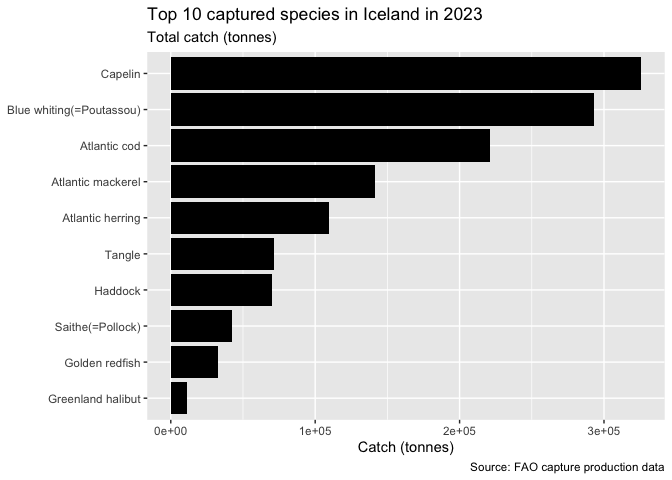
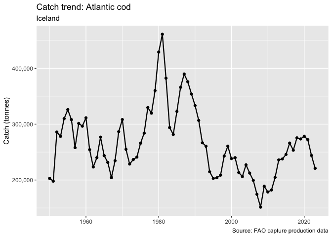
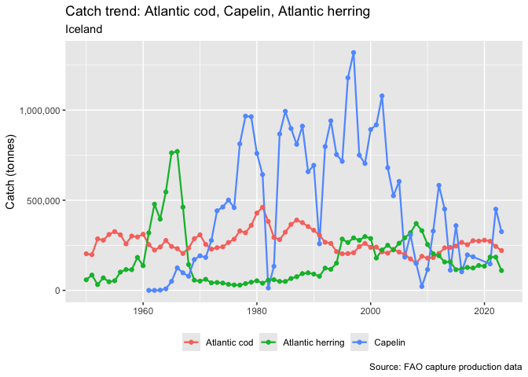
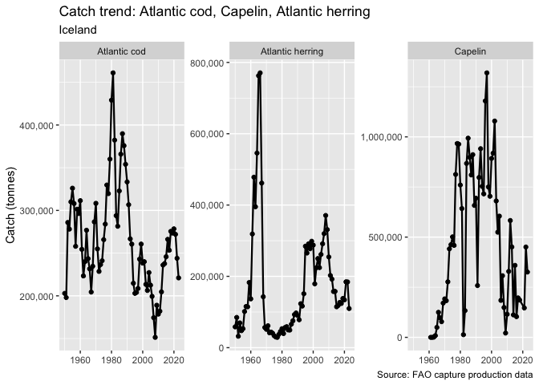
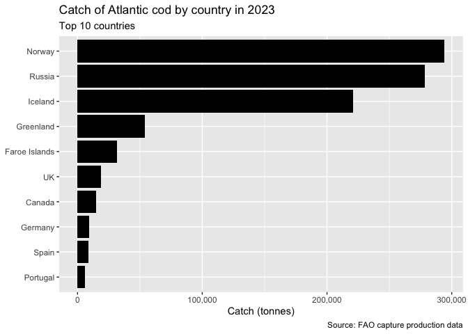
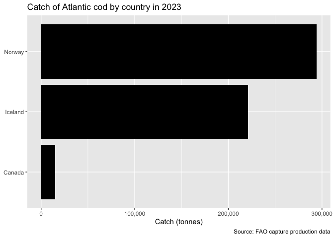
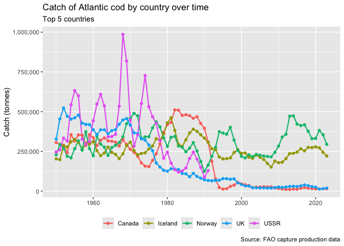
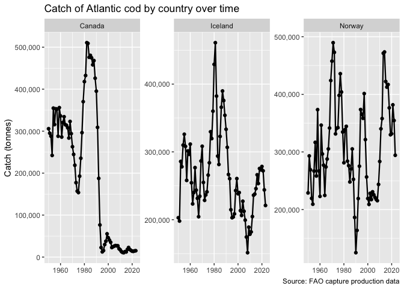
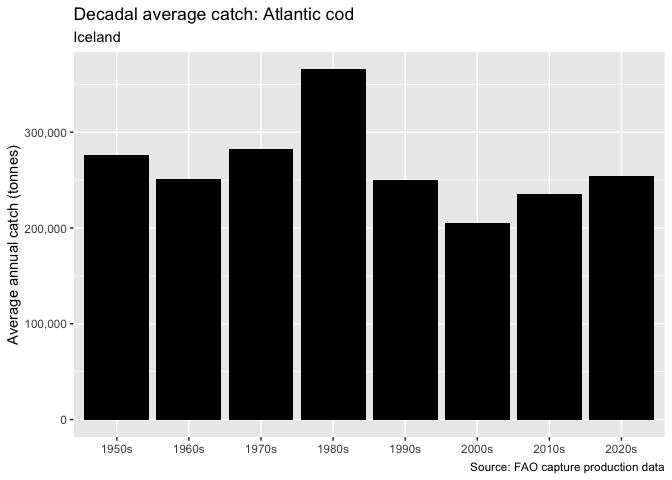
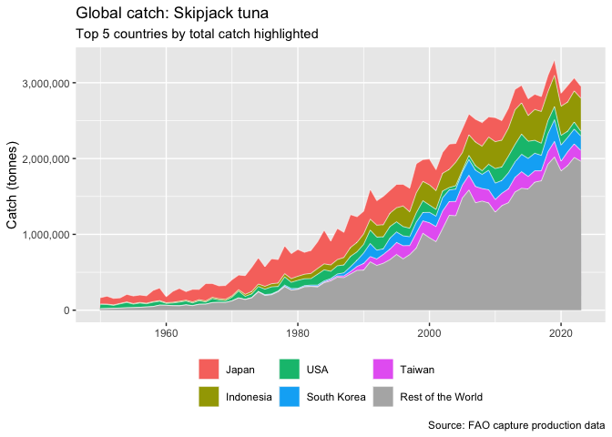

# fishr

An R package for downloading, cleaning, and visualising FAO global
capture fisheries data.

## Installation

``` r
# install.packages("remotes")
remotes::install_github("YOUR_GITHUB_USERNAME/fishr")
```

## Overview

`fishr` wraps the [FAO Global Capture Production
dataset](https://www.fao.org/fisheries/en/) with a small set of
functions to get you from raw data to analysis-ready tibbles and plots
with minimal friction.

| Function | What it does |
|----|----|
| `download_fao_capture()` | Downloads and extracts the FAO capture ZIP to a local cache |
| `load_fao_capture()` | Reads and joins quantity, country, species, and area tables |
| `clean_country_names()` | Replaces verbose FAO country names with short/common equivalents |
| `plot_top_species_country()` | Bar chart of top *n* species for a country in a given year |
| `plot_species_trend()` | Time series of catch for one or more species in a country |
| `plot_species_country_comparison()` | Compare catch of one species across countries (snapshot or trend) |
| `plot_decadal_average()` | Bar chart of average annual catch per decade for a species in a country |
| `plot_species_global_catch()` | Stacked area chart of global catch with top *n* countries highlighted |

## Usage

### Download and load data

``` r
library(fishR)

# Downloads to a user cache directory; skips if already present
data_dir <- download_fao_capture()
```

    ## Data already available at: /Users/clara/Library/Application Support/org.R-project.R/R/fishr/Capture_2025.1.0

``` r
# Returns a joined tibble ready for analysis
data <- load_fao_capture(path = data_dir)

# Optionally add short/common country names
data <- clean_country_names(data)
```

### Top species in a country (single year)

``` r
plot_top_species_country(
  data    = data,
  country = "Iceland",
  year    = 2023,
  n       = 10
)
```

<!-- -->

### Catch trend over time (single species)

``` r
plot_species_trend(
  data    = data,
  country = "Iceland",
  species = "Atlantic cod"
)
```

<!-- -->

### Catch trend — multiple species, overlapping lines

``` r
plot_species_trend(
  data    = data,
  country = "Iceland",
  species = c("Atlantic cod", "Capelin", "Atlantic herring"),
  facet   = FALSE
)
```

    ## Warning in ggplot2::geom_line(colour = if (!multi || facet) colour else NULL, : Ignoring empty
    ## aesthetic: `colour`.

    ## Warning in ggplot2::geom_point(colour = if (!multi || facet) colour else NULL, : Ignoring empty
    ## aesthetic: `colour`.

<!-- -->

### Catch trend — multiple species, faceted panels

Useful when species have very different catch magnitudes.

``` r
plot_species_trend(
  data    = data,
  country = "Iceland",
  species = c("Atlantic cod", "Capelin", "Atlantic herring"),
  facet   = TRUE
)
```

<!-- -->

### Compare catch across countries

``` r
# Bar chart — top 10 countries for a species in a single year
plot_species_country_comparison(
  data    = data,
  species = "Atlantic cod",
  year    = 2023
)
```

<!-- -->

``` r
# Bar chart — specific countries only
plot_species_country_comparison(
  data      = data,
  species   = "Atlantic cod",
  countries = c("Iceland", "Norway", "Canada"),
  year      = 2023
)
```

<!-- -->

``` r
# Time series — top 5 countries, overlapping lines
plot_species_country_comparison(
  data    = data,
  species = "Atlantic cod",
  n       = 5
)
```

<!-- -->

``` r
# Time series — specific countries, faceted panels
plot_species_country_comparison(
  data      = data,
  species   = "Atlantic cod",
  countries = c("Iceland", "Norway", "Canada"),
  facet     = TRUE
)
```

<!-- -->

### Decadal average catch

Useful for identifying long-term structural shifts in catch levels.

``` r
plot_decadal_average(
  data    = data,
  country = "Iceland",
  species = "Atlantic cod"
)
```

<!-- -->

### Global catch with top countries highlighted

Shows total global catch over time for a species, with the top *n*
countries in distinct colours and all remaining countries aggregated as
“Rest of the World” in grey. Useful for reading both overall trends and
shifts in country-level contributions simultaneously.

``` r
plot_species_global_catch(
  data    = data,
  species = "Skipjack tuna",
  n       = 5
)
```

<!-- -->

## Data source

FAO ({{year}}). *Global Capture Production*. Fisheries and Aquaculture
Division. Available at:
<https://www.fao.org/fishery/en/collection/capture>

## Status

Early development — functions and data structure may change between
versions.
